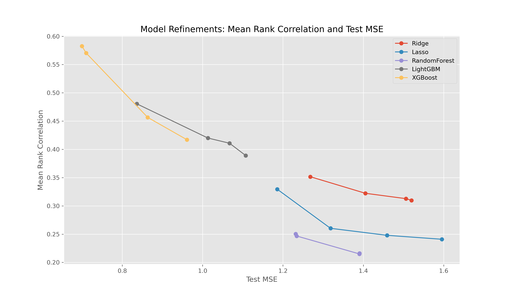
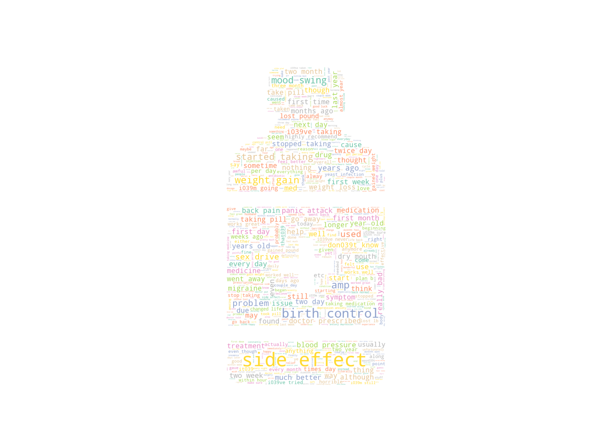

# Assignment 2: Drug Review Dataset Analysis

In this assignment, we use the drug review dataset to predict the useful counts of a given review, and propose a new metric (rank correlation) to evaluate the effectiveness of the prediction. We empirically verified that tuning MSE indeed improves performance measured by the new and more realistic metric. 

<p align="center">
  
</p>
<p align="center">
    <em>Test MSE and Equally Weighted Rank Correlation </em>
</p>


## Quick Start

Download data: ```python run.py download```  
Partition data: ```python run.py partition``` (only after downloading)  
Construct Features ```python run.py preprocess``` (only after downloading)  
EDA (make plots): ```python run.py eda``` (only after preprocess)  
Train (train and test models): ```python run.py train``` (only after preprocess)

## File Digestion

This project contains the following four folders

**data**:

- raw: raw data (from download)
- dev: subset of raw data, for developer testing purposes
- preprocessed: store preprocessed features, ready to be fed into models for training

**save_models**: dump serialized models here

**src**: stores all the code fore necessary computations

- data: download and partition data
- preprocess: construct features
- models: stores all ML models
- eda: make some (fancy) plots

**images**: stores eda images.

## Packages to Install

- WordCloud
- NLTK
- shap

## Citation

data source: <https://archive-beta.ics.uci.edu/ml/datasets/drug+review+dataset+drugs+com>  

related tutorials: <https://medium.com/sfu-cspmp/draw-drug-review-analysis-work-96212ed98941>

related papers: <https://www.sciencedirect.com/science/article/pii/S1665642317300561#bib0105>

## For Developer 

Details are written in files.

<p align="center">
  
</p>
<p align="center">
    <em>Review Wordcloud</em>
</p>
